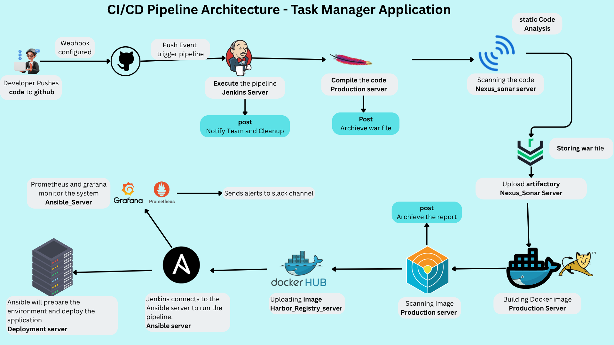

# Task Manager Web Application

## 🛠️ Technology Stack

- **Backend**: Java Servlets, JSP
- **Frontend**: HTML5, CSS3, JavaScript, JSTL
- **Database**: MySQL
- **Containerization**: Docker, Docker Compose
- **Web Server**: Apache Tomcat
- **Build Tool**: Maven
- **CI/CD**: Jenkins Pipeline
- **Configuration Management**: Ansible
- **Code Quality**: SonarQube
- **Artifact Repository**: Nexus Repository Manager
- **Security Scanning**: Trivy
- **Monitoring**: Prometheus and grafana are used to monitor all the metrics.

## 🏗️ Architecture
### Architecture Diagram

<div align="center">
  
</div>

The application follows a distributed architecture with separate VMs for different concerns:

- **Jenkins VM**: CI/CD pipeline execution and orchestration
- **Ansible VM** (192.168.56.210): Configuration management and deployment orchestration
- **Production VM**: Application deproduction target. Where we build image and push it to the image registry
- **Deployment VM**: Used for the application deployment and accessed by anisble to deploy the appliationContext
Where and when it is being communcated

- **SonarQube Server**: Static code analysis and quality gate checks
- **Nexus Repository** (192.168.56.6:8081): Artifact management and versioning
- **NOTE**: Node exporter is installed in all VMs and CAdvisor is installed in production, deployment and harbor registry virtual machine to extract the metrics.
- **Prometheus and Grafana**: To monitor the metrics we have used prometheus and grafana. Node exporter is installed in all VMs and cAvisor is installed in harbor, deployment and production VM. The prometheus rules and alerts files can be found in
- **prometheus configurations**: [Prometheus_configurations_project](https://github.com/dipen674/Prometheus_configurations_project.git)


## 📁 Project Structure

```
taskmanager-webapp/
├── src/main/
│   ├── java/com/example/taskmanager/
│   │   ├── controller/          # Servlets
│   │   ├── model/               # Data models
│   │   ├── service/             # Business logic
│   │   └── util/                # Utility classes
│   └── webapp/
│       ├── css/style.css        # Styling
│       ├── js/script.js         # Client-side logic
│       ├── WEB-INF/views/       # JSP pages
│       └── META-INF/context.xml # Database configuration
├── docker-compose.yml           # Multi-container setup
├── Dockerfile                   # Application container
├── Jenkinsfile                  # CI/CD pipeline
├── init.sql                     # Database schema
└── pom.xml                      # Maven configuration
```

## 📦 Related Repositories

- **Application Code**: [Simple_Java_TM](https://github.com/dipen674/Simple_Java_TM) (branch: `docker`)
- **Ansible Configurations**: [Ansible_configs_project](https://github.com/dipen674/Ansible_configs_project) (branch: `docker`)

## 🚀 Infrastructure Setup

### Prerequisites

#### 1. Jenkins VM Setup
```bash
# Install required software
- Install Jenkins
```

**Required Jenkins Plugins:**
- GitHub Integration Plugin
- Docker Pipeline Plugin
- SSH Agent Plugin
- Nexus Artifact Uploader
- SonarQube Scanner Plugin
- Pipeline Plugin

**Jenkins Credentials Configuration:**
- `jenkinsdockercred`: DockerHub username and password/token
- `ansible-ssh-key`: SSH private key for Ansible VM access
- `nexus-credentials`: Nexus repository credentials
- `sonar`: SonarQube authentication token


**Production Node Configuration:**
- Label: `production`
- SSH connection to Production VM
- Docker installed and accessible
- maven installed
- trivy installed
- Added as worker node of the jenkins and labeled as **production** node

#### 2. Ansible VM Setup (192.168.56.210)
```bash
- Install python
- Create Python virtual environment
- Install Ansible
- prometheus and grafana are also running in this VM

# Configure SSH access to deployment VM. Accessed by ansible to configure deployment server
ssh-keygen -t rsa
ssh-copy-id user@deployment-vm-ip
```


#### 3. SonarQube Server Setup
```bash
# Install and configure SonarQube
# Create project key: taskmanager-webapp
# Generate authentication token for Jenkins
```

**SonarQube Configuration:**
- Project Key: `taskmanager-webapp`
- Project Name: `taskmanager-webapp`
- Configure quality gates and rules as needed

#### 4. Nexus Repository Setup (192.168.56.6:8081)
```bash
# Install Nexus Repository Manager
# Create repository: Javaapp_TM
# Configure credentials for Jenkins access
```

**Nexus Repository Configuration:**
- Repository Name: `Javaapp_TM`
- Repository Type: Maven (hosted)
- Group ID: `QA`
- Create deployment user credentials

## 🔄 CI/CD Pipeline Workflow

### Pipeline Trigger
The pipeline automatically triggers on push to the `jenkins` branch via GitHub webhook integration. I have used ngrok to congigure webhook in the Github.

### Stage-by-Stage Execution

#### **Stage 1: Code Compilation**
- Here jenkins executor is production_VM which i have added as a node in jenkins
```groovy
Agent: None (uses default Jenkins executor)
Purpose: Compile Java source code and verify syntax
```
**Activities:**
- Executes `mvn clean compile`
- Downloads project dependencies
- Compiles Java servlets and classes
- Validates code structure and syntax
- SonarQube scanner tool preparation

**Output:** Compiled classes in `target/classes/`

---

#### **Stage 2: Run Unit Tests**
```groovy
Agent: None (uses default Jenkins executor)
Purpose: Execute automated unit tests
```
**Activities:**
- Runs `mvn test`
- Executes JUnit/TestNG test cases  
- Validates business logic and functionality

**Output:** Test results and reports in `target/surefire-reports/`

---

#### **Stage 3: Package Application**
```groovy
Agent: None (uses default Jenkins executor)
Purpose: Create deployable WAR artifact
```
**Activities:**
- Executes `mvn package -DskipTests`
- Packages compiled code into WAR file
- Includes web resources (JSP, CSS, JavaScript)
- Bundles configuration files
- Archives artifact in Jenkins for audit trail

**Output:** `target/taskmanager-webapp.war`

**Post-Actions:**
- Archives WAR artifact in Jenkins
- Makes artifact available for deployment

---

#### **Stage 4: SonarQube Analysis**
```groovy
Agent: None (uses default Jenkins executor)
Tool: SonarQube Scanner 7.2
Purpose: Static code analysis and quality assessment
```
**Activities:**
- Scans Java source code (`src/main/java`)
- Analyzes web resources (`src/main/webapp`)
- Evaluates code against quality profiles
- Checks for code smells, bugs, and vulnerabilities
- Calculates code coverage metrics

**Quality Metrics Analyzed:**
- Code coverage percentage
- Code duplication
- Cyclomatic complexity
- Security vulnerabilities
- Maintainability rating
- Reliability rating

---

#### **Stage 5: Upload Artifact to Nexus**
```groovy
Agent: None (uses default Jenkins executor)
Repository: Nexus (192.168.56.6:8081)
Purpose: Version and store artifacts in artifact repository
```
**Activities:**
- Authenticates with Nexus using stored credentials
- Uploads WAR file to `Javaapp_TM` repository
- Tags artifact with build ID and timestamp
- Enables version tracking and rollback capability

**Benefits:**
- Centralized artifact storage
- Version history maintenance
- Easy rollback to previous versions
- Artifact promotion across environments

---

#### **Stage 6: Build Docker Image**
```groovy
Agent: None (uses default Jenkins executor)
Purpose: Containerize application
```
**Activities:**
- Builds Docker image from Dockerfile
- Uses `--no-cache` flag for clean builds
- Tags image as `deependrabhatta/java_app:V_${BUILD_NUMBER}`
- Includes Tomcat base image
- Copies WAR file to Tomcat webapps directory
- Configures environment variables

**Tagging Strategy:**
- Format: `deependrabhatta/java_app:V_${BUILD_NUMBER}`
- Example: `deependrabhatta/java_app:V_42`
- Each build gets unique, sequential version tag

---

#### **Stage 7: Security Scanning with Trivy**
```groovy
Agent: None (uses default Jenkins executor)
Tool: Trivy Image Scanner
Purpose: Vulnerability assessment and security compliance
```
**Activities:**
- Scans Docker image for vulnerabilities
- Analyzes OS packages and application dependencies
- Generates HTML security report
- Exits with code 1 if CRITICAL vulnerabilities found

**Scan Configuration:**
- Severity Level: `CRITICAL`
- Output Format: `HTML` (using template)
- Report Location: `trivy-reports/trivy-report-${BUILD_NUMBER}.html`
- Exit Code: `1` (fails pipeline on critical issues)

**Report Management:**
- Archives all Trivy reports in Jenkins
- Implements automatic cleanup (retains only latest 3 reports)
- Reports accessible via Jenkins build artifacts

#### **Stage 8: Push Image to DockerHub**
```groovy
Agent: production (Production VM node)
Registry: DockerHub
Purpose: Publish verified image to container registry
```
**Activities:**
- Authenticates with DockerHub using credentials   
- Pushes image to public/private registry
- Makes image available for deployment
- Verifies successful upload

**Registry Details:**
- Credentials ID: `jenkinsdockercred`
- Image Repository: `deependrabhatta/java_app`
- Tag: `V_${BUILD_NUMBER}`
- Full Image Path: `deependrabhatta/java_app:V_${BUILD_NUMBER}`

---

#### **Stage 9: Deploy via Ansible Node**
```groovy
Agent: master (Jenkins master node)
Target: Ansible VM (192.168.56.210)
Purpose: deployment node
```

**SSH Connection:**
- Uses SSH private key authentication (`ansible-ssh-key`)
- Connects to Ansible VM at 192.168.56.210
- Executes remote deployment script

**Deployment Steps:**

1. **Environment Activation:**
   - Activates Python virtual environment
   - Ensures Ansible and dependencies are available

2. **Directory Preparation:**
   - Cleans previous deployment artifacts
   - Creates fresh working directory

3. **Application Files Download:**
   - Clones application repository (docker branch)
   - Copies essential deployment files
   - Includes Docker configuration and database schema

4. **Ansible Configuration Download:**
   - Clones Ansible playbook repository
   - Contains deployment roles and tasks

5. **Ansible Collection Installation:**
   - Installs Docker Ansible module
   - Enables container management capabilities

6. **Playbook Execution:**
   - Runs deployment playbook
   - Passes build number as extra variable
   - Orchestrates deployment on Production VM

**Ansible Playbook Structure:**
The playbook from [Ansible_configs_project](https://github.com/dipen674/Ansible_configs_project) includes:
- Environment setup tasks
- Docker image deployment
- Container orchestration with Docker Compose
- Health checks and validation
- Cleanup of old containers

---

### Post-Build Actions

#### **Always (After Every Build):**
```groovy
Runs on: production node
Purpose: Resource cleanup and image preparation
```
**Activities:**
- **Docker System Cleanup:**
  ```bash
  docker system prune -a -f
  ```
  - Removes unused containers, images, networks
  - Frees disk space on production node
  - Prevents storage exhaustion

- **Image Preparation:**
  - Pulls current build image: `V_${BUILD_NUMBER}`
  - Pulls previous build image: `V_${BUILD_NUMBER - 1}`
  - Enables quick rollback if needed
  - Ensures images are locally cached

#### **On Success:**
```groovy
Runs on: master node
Purpose: Success notification
```
**Email Notification:**
- **Recipients:**
  - To: bhattadeependra05@gmail.com
  - CC: bhattad625@gmail.com
  - BCC: dipakbhatt363@gmail.com
- **Subject:** BUILD SUCCESS NOTIFICATION
- **Content:** Build number, status, and build URL
- **Purpose:** Inform team of successful deployment

#### **On Failure:**
```groovy
Runs on: master node
Purpose: Failure notification and troubleshooting
```
**Email Notification:**
- **Recipients:**
  - To: bhattadeependra05@gmail.com
  - CC: dipakbhatt363@gmail.com
- **Subject:** BUILD FAILED NOTIFICATION
- **Content:** Build number, failure status, build URL for investigation
- **Purpose:** Alert team for immediate action

## 🔒 Security Features

1. **Trivy Vulnerability Scanning:**
   - Scans every Docker image for CRITICAL vulnerabilities
   - Generates detailed HTML reports
   - Pipeline fails on critical security issues

2. **SonarQube Code Analysis:**
   - Static code analysis for security vulnerabilities
   - Code quality and maintainability checks
   - Security hotspot detection

3. **Artifact Verification:**
   - All artifacts stored in Nexus with version tracking
   - Traceable deployment history
   - Rollback capability to previous versions

4. **SSH Key-Based Authentication:**
   - Secure communication between Jenkins and Ansible VM
   - No password storage in pipeline code


## 🔄 Rollback Procedure

In case of deployment issues:

1. Identify the last stable build number from Jenkins
2. Update docker-compose.yml with previous image version
3. Run deployment playbook with previous build number:
   ```bash
   ansible-playbook playbook.yaml -e "build_number=<previous_build>"
   ```

## 📝 Configuration Files

### Docker Compose Configuration
Located in the application repository, defines:
- MySQL service configuration
- Application service configuration
- Network configuration
- Volume mounts
- Health checks

### Ansible Playbook
Repository: [Ansible_configs_project](https://github.com/dipen674/Ansible_configs_project)
- Deployment roles and tasks
- Environment-specific variables
- Docker Compose orchestration
- Health check validations


## 🎯 Best Practices

1. **Always push to jenkins branch** to trigger automated deployment
2. **Monitor SonarQube metrics** regularly for code quality
3. **Review Trivy security reports** before production deployment
4. **Keep Ansible playbooks** version controlled
5. **Test in lower environments** before production deployment
6. **Maintain artifact versioning** in Nexus for audit trails
7. **Regular backup** of database and configuration files


**Note**: This application uses fully automated CI/CD deployment. Ensure proper VM configuration, network connectivity, and credential management across all infrastructure components.